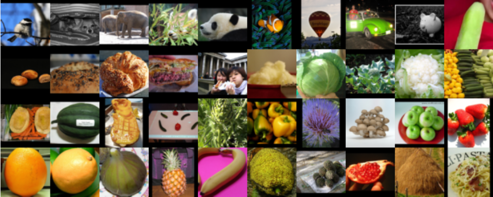

# Image Classification

### Mini Project 3 - Applied Machine Learning [COMP-551] - McGill - Winter 2017

This notebook is my shot at the third mini project from COMP-551 course. I used transfer learning from Google's pre-trained deep neural network, Inception v3, for features extraction and then Naive Bayes and SVM for classification.

  
